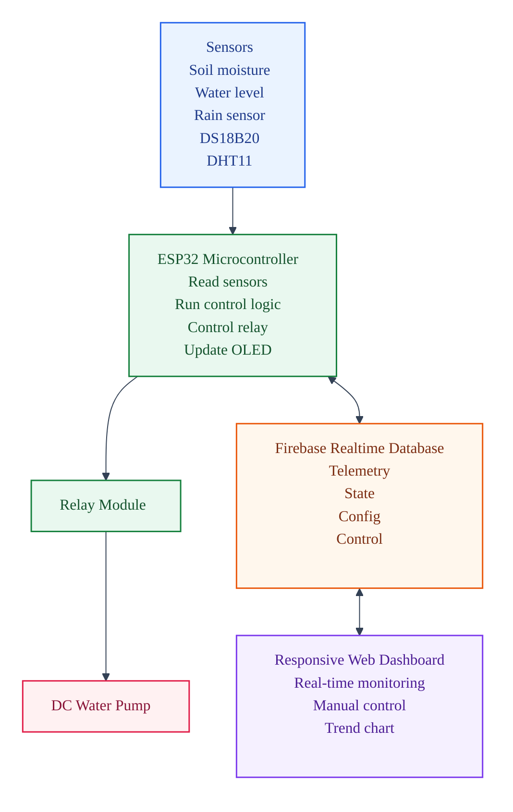
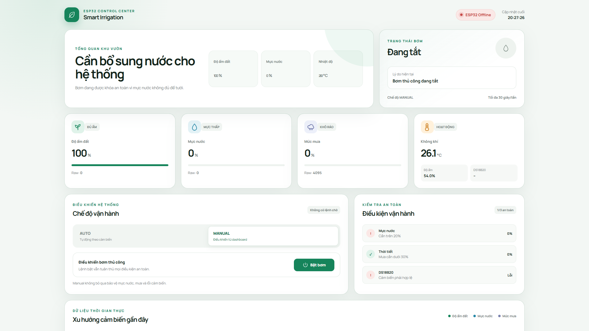
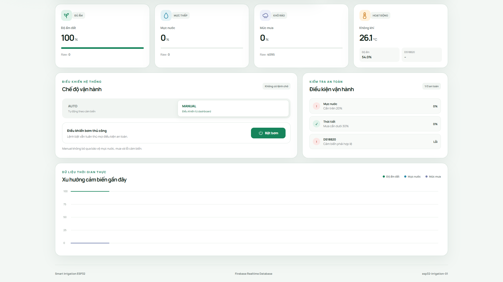
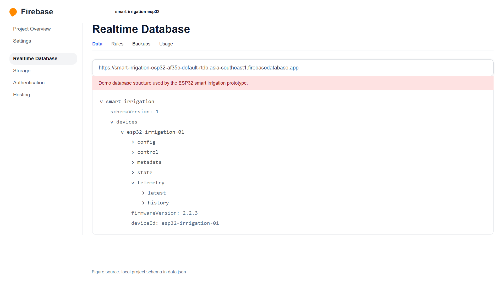

# Smart Irrigation System using ESP32 and Firebase

**Team:** Chill Out  
**Course:** Final Project - Internet of Things  
**Institution:** VNUK Institute for Research and Executive Education - The University of Danang  
**Academic Year:** 2025-2026

## Team Members

| Name | Student ID | Role |
| --- | --- | --- |
| Le Tiep Tuyen | 22020015 | Team Lead & Developer |
| Mai Thieu Tin | 22020003 | Developer |
| Doan Hong Ngoc | 22020010 | Developer |

## Project Overview

This project implements an IoT-based smart irrigation and plant monitoring system using an ESP32 microcontroller, environmental sensors, a relay-controlled water pump, Firebase Realtime Database, and a responsive web dashboard. The system monitors soil moisture, water level, rain intensity, soil temperature, air temperature, and air humidity in near real time. It can automatically control the pump based on sensor conditions or accept manual pump commands from the dashboard.

## Documentation

- [Final Project Report - English](docs/Final_Project_Report.md)
- [Final Project Report - Vietnamese](docs/Final_Project_Report_VI.md)
- [Project Proposal / Overview PDF](docs/Final_IoT_Project_Overview.pdf)

## Key Features

- ESP32 firmware built with PlatformIO and the Arduino framework.
- Sensor monitoring for soil moisture, water level, rain, DS18B20 temperature, and DHT11 temperature/humidity.
- Automatic irrigation based on soil moisture, water availability, rain detection, DS18B20 validity, pump runtime, and cooldown rules.
- Manual pump control through Firebase and the web dashboard.
- OLED display for local device status and sensor readings.
- Firebase Realtime Database synchronization for telemetry, device state, configuration, and control commands.
- Responsive static web dashboard deployable with Firebase Hosting.

## System Architecture



Additional diagram sources are stored in [`docs/diagrams`](docs/diagrams).

## Hardware and Pin Mapping

| Component | ESP32 Pin | Purpose |
| --- | --- | --- |
| Soil moisture sensor | GPIO34 | Analog soil moisture reading |
| Water level sensor | GPIO35 | Analog water level reading |
| Rain sensor | GPIO32 | Analog rain intensity reading |
| DS18B20 | GPIO19 | Soil/water temperature reading |
| DHT11 | GPIO4 | Air temperature and humidity |
| Relay module | GPIO26 | Water pump control |
| OLED SDA | GPIO21 | I2C data |
| OLED SCL | GPIO22 | I2C clock |

## Control Logic

In automatic mode, the pump turns on only when the soil moisture is below `30%`, water level is above `20%`, rain is below `30%`, the DS18B20 reading is valid, and the pump cooldown has completed. The pump turns off when the soil reaches above `45%`, water is low, rain is detected, DS18B20 is invalid, soil moisture is zero, or the pump reaches the configured `30` second runtime limit.

In manual mode, the current firmware follows the dashboard pump request directly. This mode bypasses the automatic irrigation checks, so it should be used carefully during demonstrations and testing.

## Firebase Data Structure

The project uses this main database path:

```text
smart_irrigation/devices/esp32-irrigation-01
```

Main nodes:

- `config`: effective calibration values, thresholds, upload intervals, and test mode settings.
- `control`: dashboard commands such as `mode` and `manualPumpOn`.
- `state`: online status, pump state, Wi-Fi RSSI, control mode, and last seen time.
- `telemetry/latest`: latest sensor and pump sample.
- `telemetry/history`: historical samples stored with Firebase push IDs.

The firmware updates `telemetry/latest` and `state` every `2` seconds, uploads `telemetry/history` every `60` seconds, and reads dashboard control commands about every `700` milliseconds.

## Build and Upload

Create `include/secrets.h` from `include/secrets.example.h`, then set the Wi-Fi credentials and Firebase database URL.

```powershell
pio run
pio run --target upload
pio device monitor
```

If the relay module is active LOW, set `AppConfig::RELAY_ACTIVE_LOW` to `true` in `include/app_config.h`.

## Web Dashboard

The dashboard is located in [`web`](web). It can be served as a static website or deployed to Firebase Hosting.

```powershell
npx firebase-tools deploy --only hosting
```

The dashboard polls Firebase, displays live sensor values, shows a recent trend chart, switches between auto/manual mode, and writes pump commands to the `control` node.

## Screenshots

**Web dashboard overview**



**Dashboard control panel and trend chart**



**Firebase Realtime Database structure**



## Firebase Setup

1. Create a Firebase Realtime Database.
2. Import [`data.json`](data.json) as the initial schema.
3. Remove `telemetry/history/sample_remove_after_import` after import.
4. Publish [`database.rules.json`](database.rules.json) in the Firebase Rules tab.

The included rules allow public read/write access for demonstration only. A production deployment should use Firebase Authentication and stricter database rules.

## Repository Structure

```text
include/                 Firmware configuration and shared state types
src/                     ESP32 firmware and Firebase synchronization
web/                     Static responsive dashboard
docs/                    Project overview PDF and diagram sources
data.json                Initial Firebase Realtime Database schema
firebase.json            Firebase Hosting and database configuration
platformio.ini           PlatformIO project configuration
```
