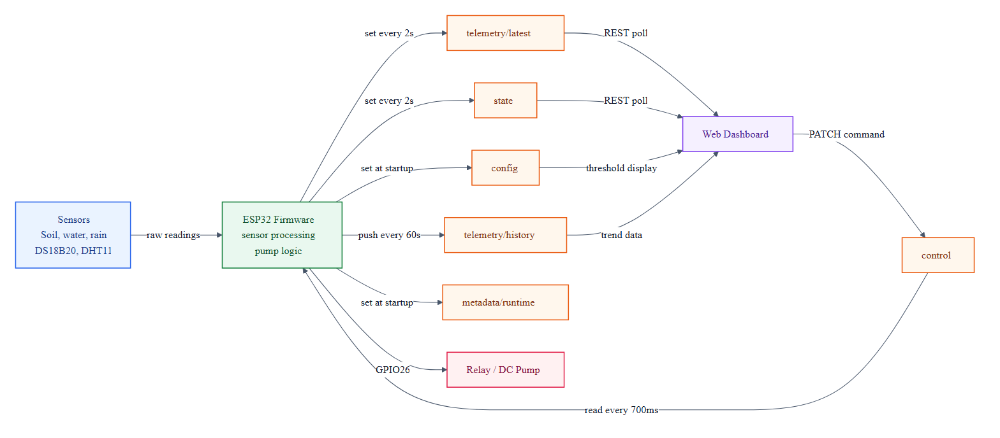

# Cloud Database Layer: Firebase Realtime Database

**Project:** Smart Irrigation System using ESP32 and Firebase  
**Device ID:** `esp32-irrigation-01`  
**Main database path:** `smart_irrigation/devices/esp32-irrigation-01`

## 1. Purpose

Firebase Realtime Database is the cloud bridge between the physical IoT device and the web dashboard. In this project, it stores live sensor data, device state, runtime metadata, configuration values, historical telemetry, and dashboard control commands.

The ESP32 is the main writer for telemetry and state data. The web dashboard is the main writer for control commands.



_Source: `docs/diagrams/cloud-database-layer-flow.mmd`._

## 2. Database Schema

```text
smart_irrigation
├── schemaVersion
└── devices
    └── esp32-irrigation-01
        ├── config
        ├── control
        ├── metadata
        ├── state
        └── telemetry
            ├── latest
            └── history
```

| Node | Role |
| --- | --- |
| `schemaVersion` | Database schema version. The current export uses version `1`. |
| `devices` | Container for all IoT devices. |
| `esp32-irrigation-01` | The current ESP32 device node. |

## 3. `config`

`config` stores the effective firmware configuration uploaded by the ESP32. It helps the dashboard and reviewers understand the calibration values, thresholds, upload intervals, and test settings currently used by the device.

| Field | Meaning |
| --- | --- |
| `autoPumpEnabled` | Indicates whether automatic pump logic is enabled in firmware. |
| `calibration.soil.dryRaw` / `wetRaw` | Raw ADC reference values for dry and wet soil. |
| `calibration.water.emptyRaw` / `fullRaw` | Raw ADC reference values for empty and full water level. |
| `calibration.rain.dryRaw` / `wetRaw` | Raw ADC reference values for dry and wet rain sensor states. |
| `thresholds.soilPumpOnPercent` | Soil moisture threshold for turning the pump on in automatic mode. Current value: `30%`. |
| `thresholds.soilPumpOffPercent` | Soil moisture threshold for turning the pump off. Current value: `45%`. |
| `thresholds.minimumWaterPercent` | Minimum water level required before pumping. Current value: `20%`. |
| `thresholds.rainDetectedPercent` | Rain threshold that blocks automatic irrigation. Current value: `30%`. |
| `thresholds.maximumPumpRuntimeMs` | Maximum pump runtime per cycle. Current value: `30000 ms`. |
| `thresholds.pumpCooldownMs` | Cooldown after pump shutdown. Current value: `5000 ms`. |
| `uploadIntervals.latestMs` | Upload interval for `telemetry/latest` and `state`. Current value: `2000 ms`. |
| `uploadIntervals.historyMs` | Push interval for `telemetry/history`. Current value: `60000 ms`. |
| `testMode` | Firmware test-mode information, such as forced soil percentage and runtime-limit status. |

## 4. `control`

`control` is the command node written by the web dashboard and read by the ESP32.

```json
{
  "mode": "manual",
  "manualPumpOn": false,
  "updatedAt": 1782397410821,
  "updatedBy": "web-dashboard"
}
```

| Field | Meaning |
| --- | --- |
| `mode` | Current control mode: `auto` or `manual`. |
| `manualPumpOn` | Manual pump request from the dashboard. |
| `updatedAt` | Timestamp of the latest dashboard command. |
| `updatedBy` | Command source, usually `web-dashboard`. |

The ESP32 reads `control/mode` and `control/manualPumpOn` about every `700 ms`. In the current firmware, manual mode directly follows the dashboard command and bypasses automatic safety checks, so it should be used carefully during demonstrations.

## 5. `metadata`

`metadata` identifies the device and records runtime information.

| Field | Meaning |
| --- | --- |
| `deviceId` | Device identifier: `esp32-irrigation-01`. |
| `name` | Human-readable device name. |
| `board` | Hardware board, currently `ESP32`. |
| `location` | Deployment location, such as `garden`. |
| `firmwareVersion` | Static firmware metadata value. |
| `runtime.firmwareVersion` | Firmware version uploaded by the running firmware. |
| `runtime.bootedAt` | Firebase server timestamp when the runtime metadata was uploaded. |
| `runtime.bootedAtText` | Human-readable boot time, or `TIME_NOT_SYNCED` if NTP is not ready. |

## 6. `state`

`state` represents the latest operational status of the ESP32.

| Field | Meaning |
| --- | --- |
| `online` | Whether the device reported itself online during the latest update. |
| `lastSeen` | Firebase server timestamp of the latest state update. |
| `lastSeenText` | Human-readable time generated by the ESP32. |
| `uptimeMs` | ESP32 uptime in milliseconds. |
| `wifiRssi` | Wi-Fi signal strength. |
| `pumpOn` | Current pump state. |
| `pumpReason` | Firmware reason for the current pump state. |
| `controlMode` | Mode currently applied by the ESP32. |
| `manualPumpRequested` | Manual pump request currently known by the ESP32. |
| `autoPumpEnabled` | Whether automatic pump behavior is currently active. |

The dashboard uses `state.lastSeen` and `state.online` to show whether the ESP32 is online or offline.

## 7. `telemetry/latest`

`telemetry/latest` stores the most recent sensor and pump sample. This node is overwritten every upload cycle and is used for real-time dashboard cards.

| Field | Meaning |
| --- | --- |
| `soil.raw` | Raw ADC value from the soil moisture sensor. |
| `soil.percent` | Soil moisture mapped to `0-100%`. |
| `water.raw` | Raw ADC value from the water level sensor. |
| `water.percent` | Water level mapped to `0-100%`. |
| `rain.raw` | Raw ADC value from the rain sensor. |
| `rain.percent` | Rain intensity mapped to `0-100%`. |
| `temperature.ds18b20.celsius` | Temperature from the DS18B20 sensor. |
| `temperature.ds18b20.valid` | Validity flag for DS18B20 reading. |
| `temperature.dht11.celsius` | Air temperature from DHT11. |
| `temperature.dht11.valid` | Validity flag for DHT11 temperature/humidity reading. |
| `humidity.dht11.percent` | Air humidity from DHT11. |
| `humidity.dht11.valid` | Validity flag for humidity reading. |
| `pump.on` | Pump state at the sampling time. |
| `pump.reason` | Pump reason at the sampling time. |
| `timestamp` | Firebase server timestamp. |
| `timestampText` | Human-readable timestamp from ESP32. |
| `uptimeMs` | ESP32 uptime when the sample was collected. |

## 8. `telemetry/history`

`telemetry/history` stores historical samples using Firebase push IDs.

Each history record has a structure similar to `telemetry/latest`, but it is appended instead of overwritten. This node is useful for trend charts, debugging, and reviewing pump behavior over time.

In the current exported sample, the history node contains `177` telemetry records.

## 9. Device-to-Database Mapping

| Hardware / Firmware Source | Firebase Field |
| --- | --- |
| Soil moisture sensor on GPIO34 | `telemetry.latest.soil` |
| Water level sensor on GPIO35 | `telemetry.latest.water` |
| Rain sensor on GPIO32 | `telemetry.latest.rain` |
| DS18B20 on GPIO19 | `telemetry.latest.temperature.ds18b20` |
| DHT11 on GPIO4 | `telemetry.latest.temperature.dht11`, `telemetry.latest.humidity.dht11` |
| Relay / pump on GPIO26 | `state.pumpOn`, `state.pumpReason`, `telemetry.latest.pump` |
| Dashboard mode switch | `control.mode` |
| Dashboard pump button | `control.manualPumpOn` |

## 10. Key Presentation Points

- Firebase Realtime Database connects the ESP32 device and the web dashboard in near real time.
- `telemetry/latest` is for live monitoring; `telemetry/history` is for historical records.
- `state` describes the current ESP32 status; `telemetry` describes sensor readings.
- `control` is the command interface from the dashboard to the ESP32.
- `config` documents calibration values, thresholds, and upload intervals used by the firmware.
- The ESP32 uploads latest telemetry and state every `2000 ms`, pushes history every `60000 ms`, and reads control commands every `700 ms`.
- The current demo configuration uses public Firebase access; a production version should use Firebase Authentication and stricter security rules.
