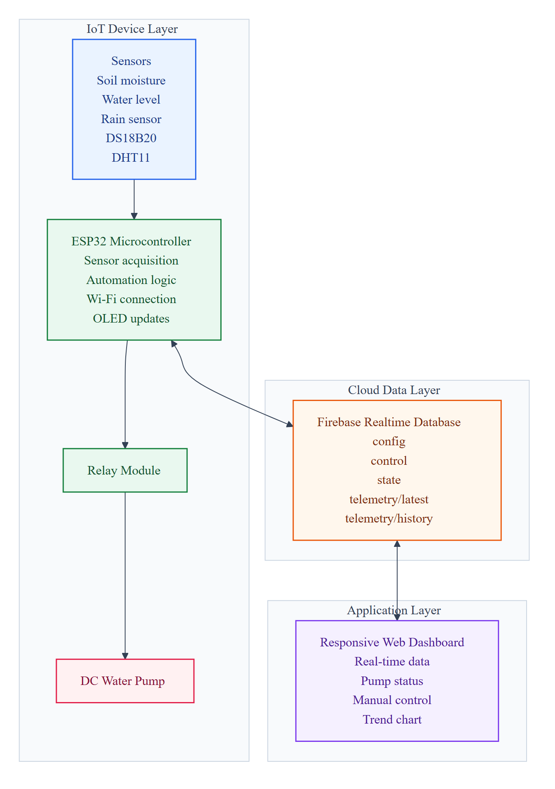
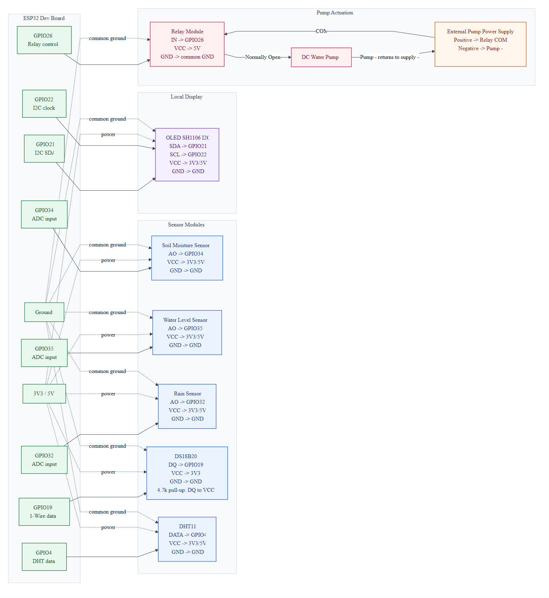
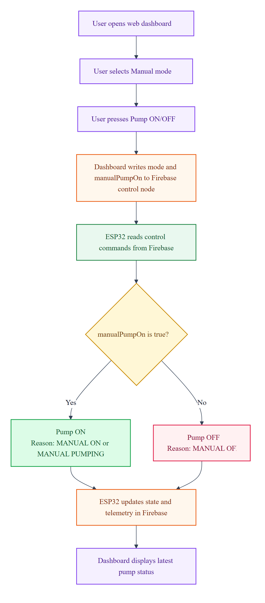

# Báo cáo cuối kỳ: Smart Irrigation System using ESP32 and Firebase

**Team:** Chill Out  
**Course:** Final Project - Internet of Things  
**Institution:** VNUK Institute for Research and Executive Education - The University of Danang  
**Academic Year:** 2025-2026

## Team Members

| Name | Student ID | Role |
| --- | --- | --- |
| Le Tiep Tuyen | 22020015 | Team Lead & Developer |
| Mai Thieu Tin | 22020003 | Developer |
| Doan Hong Ngoc | 22020010 | Developer |

## Tóm tắt

Dự án này xây dựng một **IoT-based Smart Irrigation and Plant Monitoring System** sử dụng **ESP32 microcontroller**, các **environmental sensors**, **relay-controlled water pump**, **Firebase Realtime Database**, và **responsive web dashboard**. Hệ thống đo **soil moisture**, **water level**, **rain intensity**, **soil temperature**, **air temperature**, và **air humidity**. Dựa trên dữ liệu cảm biến, hệ thống có thể điều khiển **water pump** ở **automatic mode**, hoặc nhận lệnh điều khiển từ người dùng thông qua **dashboard** ở **manual mode**. Prototype này thể hiện đầy đủ luồng IoT từ thu thập dữ liệu vật lý, xử lý tại thiết bị, đồng bộ dữ liệu lên cloud, đến giám sát và điều khiển từ xa.

## 1. Giới thiệu

Việc tưới cây thủ công thường không ổn định vì người dùng không luôn biết chính xác tình trạng độ ẩm đất, lượng nước trong bình, hoặc điều kiện môi trường xung quanh. Điều này có thể dẫn đến tưới thiếu, tưới quá nhiều, hoặc phản ứng chậm khi cây cần nước.

Hệ thống **smart irrigation** giải quyết vấn đề này bằng cách sử dụng **ESP32** để đọc dữ liệu từ các cảm biến, xử lý logic điều khiển **pump**, đồng bộ dữ liệu lên **Firebase Realtime Database**, và hiển thị thông tin trên **web dashboard**. Dự án phù hợp với phạm vi đồ án cuối kỳ môn **Internet of Things** vì có đầy đủ các thành phần: **sensing**, **connectivity**, **cloud synchronization**, **automation**, **actuation**, và **user interface**.

## 2. Mục tiêu dự án

Mục tiêu chính của dự án là thiết kế và triển khai một prototype có thể giám sát điều kiện cây trồng và điều khiển **water pump** theo dữ liệu cảm biến hoặc theo lệnh từ người dùng.

Các mục tiêu cụ thể:

- Đọc dữ liệu từ **soil moisture sensor**, **water level sensor**, **rain sensor**, **DS18B20**, và **DHT11**.
- Chuyển đổi một số giá trị **analog raw** sang dạng phần trăm để dễ quan sát.
- Hiển thị trạng thái local trên **OLED display**.
- Điều khiển **water pump** thông qua **relay module**.
- Upload **telemetry** và **device state** lên **Firebase Realtime Database**.
- Cung cấp **web dashboard** để theo dõi dữ liệu gần real-time và gửi lệnh điều khiển.
- Triển khai **automatic pump logic** với các điều kiện như **low water**, **rain detection**, **invalid DS18B20 reading**, **pump runtime limit**, và **cooldown**.

## 3. Kiến trúc hệ thống

Hệ thống được chia thành bốn lớp chính:

1. **Sensing and Actuation Layer:** gồm sensors, relay module, và water pump.
2. **Edge Device Layer:** ESP32 firmware xử lý sensor reading, control logic, OLED display, Wi-Fi, và Firebase synchronization.
3. **Cloud Data Layer:** Firebase Realtime Database lưu telemetry, state, config, và control commands.
4. **Application Layer:** responsive web dashboard để theo dõi và điều khiển.



_Source: `docs/diagrams/system-architecture.mmd`._

## 4. Hardware Components và Pin Mapping

| Component | ESP32 Pin | Purpose |
| --- | --- | --- |
| Soil moisture sensor | GPIO34 | Đọc analog soil moisture |
| Water level sensor | GPIO35 | Đọc analog water level |
| Rain sensor | GPIO32 | Đọc analog rain intensity |
| DS18B20 | GPIO19 | Đọc temperature |
| DHT11 | GPIO4 | Đọc air temperature và air humidity |
| Relay module | GPIO26 | Điều khiển water pump |
| OLED SDA | GPIO21 | I2C data line |
| OLED SCL | GPIO22 | I2C clock line |

**Relay module** được dùng để điều khiển **DC water pump**. **Pump** nên sử dụng nguồn ngoài phù hợp, không cấp nguồn trực tiếp từ ESP32.

**Figure 2. Circuit wiring map dựa trên firmware pin configuration hiện tại.**



_Source: `docs/diagrams/circuit-wiring-map.mmd`._

## 5. Software Stack

| Layer | Technology |
| --- | --- |
| Firmware framework | Arduino framework trên PlatformIO |
| Microcontroller platform | ESP32 Dev Board |
| Display library | U8g2 |
| Temperature libraries | OneWire, DallasTemperature, DHT sensor library |
| Cloud library | FirebaseClient |
| Cloud database | Firebase Realtime Database |
| Dashboard | HTML, CSS, JavaScript |
| Hosting configuration | Firebase Hosting |

## 6. Firmware Design

Firmware được tổ chức xoay quanh các phần chính: cấu hình hệ thống, đọc cảm biến, điều khiển pump, cập nhật OLED, và đồng bộ Firebase.

Các file quan trọng:

- `include/app_config.h`: định nghĩa device ID, firmware version, pin mapping, calibration values, thresholds, và scheduling intervals.
- `include/system_state.h`: định nghĩa `SensorSnapshot` để lưu sample cảm biến mới nhất.
- `src/main.cpp`: xử lý sensor reading, pump logic, OLED rendering, relay handling, và main loop scheduling.
- `src/firebase_sync.cpp`: xử lý Wi-Fi connection, Firebase initialization, telemetry upload, state upload, metadata upload, và đọc control commands.

Main loop sử dụng `millis()` để chia lịch chạy thay vì delay dài:

- Sensor reading interval: `2000 ms`.
- OLED refresh interval: `500 ms`.
- Firebase latest telemetry/state upload: `2000 ms`.
- Firebase history upload: `60000 ms`.
- Firebase control command read interval: `700 ms`.
- Wi-Fi reconnect interval: `10000 ms`.

## 7. Sensor Processing

ESP32 đọc các **analog sensors** bằng cách lấy trung bình 10 sample cho mỗi lần đọc. Cách này giúp giảm nhiễu ngắn hạn trước khi map giá trị raw sang phần trăm.

Các xử lý chính:

- **Soil moisture raw value** được map sang `0-100%` dựa trên calibration dry/wet.
- **Water level raw value** được map sang `0-100%` dựa trên calibration empty/full.
- **Rain raw value** được map sang `0-100%` dựa trên calibration dry/wet.
- **DS18B20 temperature** được kiểm tra hợp lệ theo khoảng đo và trạng thái disconnected.
- **DHT11 temperature/humidity** được kiểm tra trong khoảng giá trị hợp lý.

Dữ liệu sau khi đọc được lưu vào `SensorSnapshot`, sau đó dùng cho automation logic, OLED display, và Firebase upload.

## 8. Pump Control Logic

Hệ thống có hai chế độ điều khiển: **automatic mode** và **manual mode**.

### 8.1 Automatic Mode

Trong **automatic mode**, ESP32 tự quyết định bật/tắt **pump** dựa trên sensor values và thresholds.

Pump có thể bật khi:

- Soil moisture lớn hơn `0%` và nhỏ hơn `30%`.
- Water level lớn hơn `20%`.
- Rain intensity nhỏ hơn `30%`.
- DS18B20 reading hợp lệ.
- Pump cooldown đã hoàn tất.
- Automatic pump control đang được bật.

Pump sẽ tắt khi:

- Soil moisture lớn hơn `45%`.
- Water level quá thấp.
- Rain được phát hiện.
- DS18B20 reading không hợp lệ.
- Soil moisture bằng `0%`.
- Pump runtime đạt `30000 ms`.
- Automatic pump control bị tắt.

Cooldown sau khi tắt pump là `5000 ms`.

### 8.2 Manual Mode

Trong **manual mode**, dashboard ghi `mode: "manual"` và `manualPumpOn` vào Firebase. ESP32 đọc các giá trị này và điều khiển pump theo yêu cầu. Trong firmware hiện tại, **manual mode bypass automatic safety checks**, vì vậy chế độ này cần được sử dụng cẩn thận khi demo hoặc testing.



_Source: `docs/diagrams/manual-control-flow.mmd`._

## 9. Firebase Realtime Database Design

Firebase path chính:

```text
smart_irrigation/devices/esp32-irrigation-01
```

| Node | Description |
| --- | --- |
| `metadata/runtime` | Firmware version, board name, boot time metadata |
| `config` | Calibration, thresholds, upload intervals, test mode settings |
| `control` | Dashboard commands như `mode` và `manualPumpOn` |
| `state` | Online status, pump status, RSSI, control mode, last seen time |
| `telemetry/latest` | Sensor và pump data mới nhất |
| `telemetry/history` | Historical telemetry samples theo Firebase push IDs |

Firmware tạo JSON payload cho telemetry, state, runtime metadata, và effective configuration. Dữ liệu mới nhất được upload thường xuyên, còn history được push theo interval dài hơn.

**Figure 4. Firebase Realtime Database structure được sử dụng trong prototype.**


_Source: `data.json` và Firebase Realtime Database path đã cấu hình._

## 10. Web Dashboard Design

Dashboard là static web application trong thư mục `web`.

Các chức năng chính:

- Poll Firebase mỗi `700 ms`.
- Hiển thị online/offline status dựa trên `state.lastSeen`.
- Hiển thị soil moisture, water level, rain intensity, air temperature, air humidity, và DS18B20 temperature.
- Hiển thị pump status và pump reason.
- Hiển thị recent trend chart cho soil, water, và rain values.
- Chuyển giữa automatic mode và manual mode.
- Gửi manual pump command bằng cách patch Firebase `control` node.
- Có retry logic khi gửi control commands.

**Figure 5. Web dashboard overview với sensor cards và pump state.**


**Figure 6. Web dashboard control panel và recent trend chart.**


## 11. Testing Plan

| Test Case | Scenario | Expected Behavior |
| --- | --- | --- |
| TC-01 | ESP32 khởi động với Wi-Fi credentials hợp lệ | Thiết bị kết nối Wi-Fi và bắt đầu Firebase synchronization |
| TC-02 | Soil sensor được đọc | Raw value và percentage được cập nhật |
| TC-03 | Water sensor được đọc | Water percentage được cập nhật |
| TC-04 | Rain sensor được đọc | Rain percentage được cập nhật |
| TC-05 | DHT11 hợp lệ | Air temperature và humidity được upload |
| TC-06 | DS18B20 hợp lệ | Temperature được upload và auto mode có thể tiếp tục |
| TC-07 | Water level thấp hơn threshold trong auto mode | Pump giữ OFF với reason `LOW WATER` |
| TC-08 | Rain đạt threshold trong auto mode | Pump giữ OFF với reason `RAINING` |
| TC-09 | Soil moisture khô trong auto mode và các điều kiện safety pass | Pump ON với reason `SOIL DRY` |
| TC-10 | Soil moisture đủ ẩm | Pump OFF với reason `SOIL WET` |
| TC-11 | Manual pump command được gửi từ dashboard | ESP32 làm theo dashboard command |
| TC-12 | Firebase connection tạm thời không có | Local pump logic vẫn tiếp tục dựa trên firmware state |

Các test case này là kịch bản xác thực nên thực hiện trên prototype vật lý trước khi nộp final.

## 12. Limitations

Prototype hiện tại có một số giới hạn:

- Firebase rules đang cho phép public read/write để thuận tiện demo.
- Một số dashboard control messages cần được review lại encoding trước khi public release.
- Manual mode hiện tại làm theo pump command trực tiếp và bypass automatic safety checks.
- Calibration values có thể cần chỉnh theo sensor thật, loại đất, và water tank.
- Hệ thống chưa có authentication, alert notifications, predictive irrigation, hoặc multi-device management.

## 13. Future Improvements

Các hướng cải tiến:

- Thêm Firebase Authentication và database rules chặt chẽ hơn.
- Thêm dashboard-based threshold editing nếu firmware được mở rộng để đọc dynamic threshold values.
- Thêm notification alerts cho low water, sensor errors, hoặc long offline periods.
- Thêm historical analytics theo ngày/tuần.
- Hỗ trợ multiple ESP32 devices hoặc multiple plant zones.
- Cải thiện manual mode với optional safety constraints.

## 14. Kết luận

Dự án đã tích hợp các thành phần quan trọng của một hệ thống IoT hoàn chỉnh: embedded sensing, local control, cloud synchronization, và web-based monitoring. ESP32 thu thập environmental data, xử lý pump control logic, điều khiển relay-controlled pump, hiển thị trạng thái trên OLED, và đồng bộ telemetry/state lên Firebase. Web dashboard cung cấp real-time monitoring và remote control. Tổng thể, hệ thống thể hiện rõ các khái niệm cốt lõi của IoT: sensing, connectivity, cloud data exchange, actuation, automation, và user interaction.
